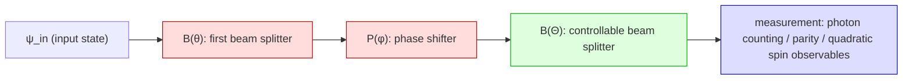
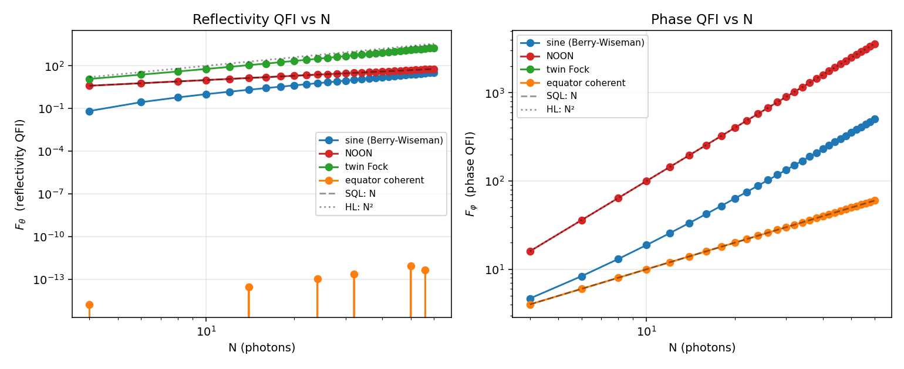
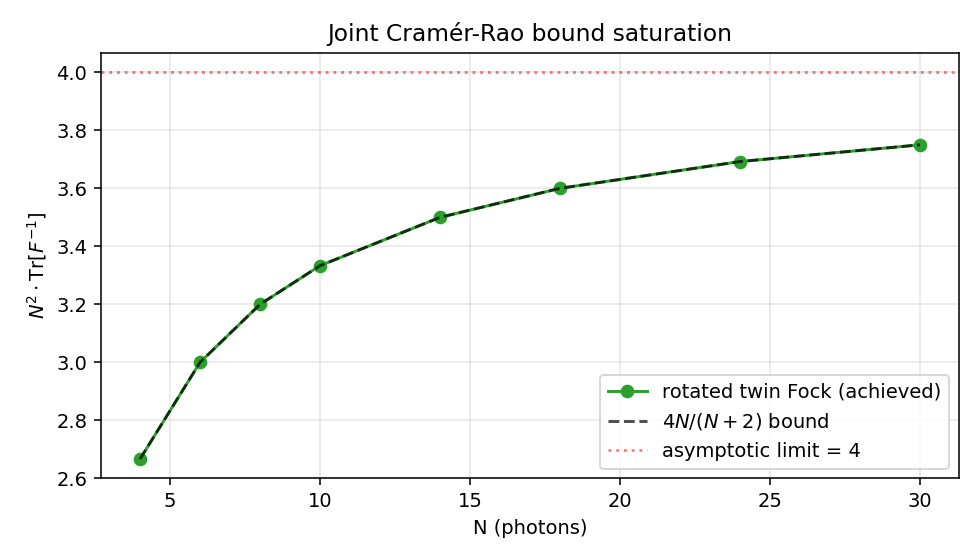
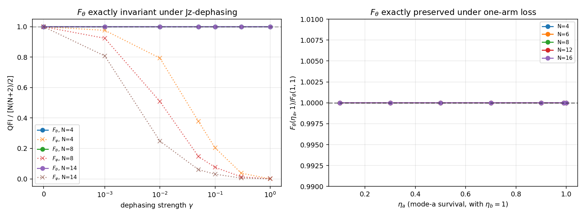
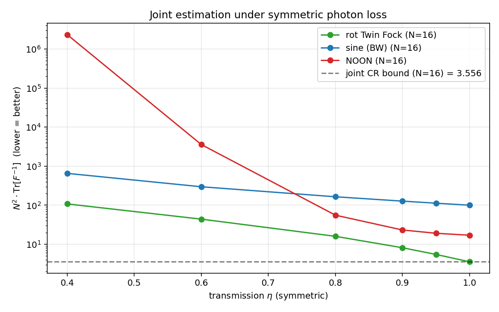

# Multi-parameter Mach-Zehnder estimation (numerical exploration)

> [!IMPORTANT]
> **This repository is largely AI-generated and has not yet been reviewed by a
> human domain expert.** It was produced over a series of conversational
> sessions in May 2026 using Anthropic's Claude as the primary author of the
> code, derivations, and exposition. Numerical results pass internal smoke
> tests, but several "novel-looking" findings are flagged below as
> **conjectures** that *require independent verification* by a quantum-
> metrology theorist before being treated as research claims. Please read the
> [Caveats and shortcomings](#caveats-and-shortcomings) section before citing.

---

A Python toolkit + reproducible experiments for two-parameter (beam-splitter
reflectivity *θ*, phase shift *φ*) quantum Mach-Zehnder metrology with twin-
Fock-class probe states, including symmetric and asymmetric photon loss and
*J*ᶻ-dephasing.

The repository accompanies (and extends) the 2020 University of Calgary
M.Sc. thesis by Hamza Qureshi, [*Variable Beam-Splitter Reflectivity Estimation
for Interferometry*](https://ucalgary.scholaris.ca/items/f65d88e6-50cb-4ef9-8ece-a6de6895717d),
which addressed the *single*-parameter version of the same problem.

---

## Table of contents

1. [Background](#background)
2. [What this code computes](#what-this-code-computes)
3. [Headline numerical findings](#headline-numerical-findings)
4. [Reproducing the results](#reproducing-the-results)
5. [Caveats and shortcomings](#caveats-and-shortcomings)
6. [What is genuinely new vs known](#what-is-genuinely-new-vs-known)
7. [Significance and context](#significance-and-context)
8. [Repository layout](#repository-layout)
9. [References](#references)
10. [License & citation](#license--citation)

---

## Background

A standard Mach-Zehnder interferometer (MZI) carries two physically meaningful
parameters: the reflectivity of the beam splitters and the phase shift between
the arms. Most quantum metrology work treats one of these (almost always the
phase) as the unknown and the others as ideal/calibrated. The 2020 thesis
investigated the complementary case — variable reflectivity, fixed phase —
and showed it is a different SU(2) rotation problem with its own optimization
challenges.

This repository pushes that direction further by treating both parameters as
*simultaneously unknown* and asking how well they can be jointly estimated
under realistic noise (photon loss, dephasing). The relevant tools come from
multi-parameter quantum estimation theory: the Symmetric Logarithmic
Derivative (SLD) Cramér-Rao bound, the (tighter) Holevo Cramér-Rao bound, the
quantum Fisher information matrix, and method-of-moments classical Fisher
information for specific measurements.



The two unknown parameters in red (θ, φ); the controllable parameter Θ in
green; the measurement in blue.

## What this code computes

For arbitrary probe state |ψ_in⟩ on the symmetric N-photon Fock subspace
(j = N/2):

| Quantity | What it tells you |
|---|---|
| `qfi_two_param_inbetween(N, χ)` | 2×2 SLD QFI matrix on the in-between state χ |
| `lossy_qfi_matrix(N, ψ_in, η, …)` | 2×2 SLD QFI matrix after symmetric photon loss |
| `hcrb_sdp(ρ, ∂ρ_list)` | Holevo Cramér-Rao bound via cvxpy SDP |
| `mom_fisher_matrix(ρ_func, params, observables)` | classical Fisher matrix of method-of-moments readout |
| `compatibility_inbetween(N, χ)` | Matsumoto compatibility ⟨Jy⟩ for SLD-bound saturability |

Symmetric photon loss is implemented as a Kraus channel acting after the
first beam splitter; asymmetric loss (η_a ≠ η_b) is implemented in
`experiments/05_invariances.py`. Dephasing acts as exp(−γ(m_i − m_j)²) on
*J*ᶻ-basis coherences.

The Holevo SDP is ported from
[Albarelli, Friel, Datta, *Phys. Rev. Lett.* **123**, 200503 (2019)](https://doi.org/10.1103/PhysRevLett.123.200503).
The existing Python port at [`tantrix10/HCRB_SDP`](https://github.com/tantrix10/HCRB_SDP)
has hardcoded `npar = 3` and an undefined-variable bug; we re-implemented the
SDP from scratch using cvxpy's complex-Hermitian variables.

## Headline numerical findings

These are presented as *numerical observations*. The status (proven /
conjectured / repeating known result) is in the table below.

### Finding 1 — Reflectivity QFI vs phase QFI for standard probes

For the four standard probe states (sine state, NOON, twin Fock, equator
spin-coherent), the single-parameter QFIs scale as follows:



Numerical fit of asymptotic prefactors (N = 60):

| probe | F_θ slope | F_φ slope | F_θ / N² @ N=60 | F_φ / N² @ N=60 |
|---|---|---|---|---|
| sine (Berry-Wiseman)   | 2.12 | 1.78 | 0.0096 | 0.140 |
| NOON                   | 1.00 | 2.00 | 0.0167 | 1.000 |
| twin Fock              | 1.89 | n/a  | 0.517  | 0     |
| equator spin coherent  | n/a  | 1.00 | 0      | 0.017 |

(Slope ≈ 2 ⇒ Heisenberg scaling; slope ≈ 1 ⇒ standard quantum limit.)

Status: **all rederivations of known results**.

### Finding 2 — Joint Cramér-Rao bound and saturating probe

For two-parameter (θ, φ) MZ estimation the SLD-CR bound is

> **`Tr[F⁻¹] ≥ 4 / (N(N+2))`**, asymptotically `N²·Tr[F⁻¹] → 4`.

This is the standard SU(2) isotropy bound (Liu et al. 2020 review). The
saturating probe is the **rotated twin Fock state**

> **|ψ_opt⟩ = exp(−i π/2 · J_x) |N/2, N/2⟩**

— equivalently the *in-between state* of an MZI with twin Fock injection
and a 50:50 first beam splitter (the Holland-Burnett 1993 configuration).

Numerical verification to N = 30 ([experiment 02](experiments/02_joint_bound.py)):



Status: **rederivation**. Liu-Yuan-Lu-Wang J. Phys. A **53**, 023001 (2020),
Du-Liu-Steinhoff-Vitagliano arXiv:2412.19119 (2024) cover this.

### Finding 3 — Minimal saturating method-of-moments readout: just **two** observables

For the rotated twin Fock probe at the slightly-off-symmetric operating point,
the method-of-moments classical Fisher matrix from a 2-observable set saturates
the joint quantum CR bound:

> **D_min = { J_x² ,  (J_x J_z + J_z J_x) / 2 }**

(only 2 quadratic spin observables — set D used earlier had 6, of which 4
were redundant)

| N | minimal-set N²·Tr[F_C⁻¹] | bound | gap |
|---|---|---|---|
| 4  | 2.667 | 2.667 | 0.0% |
| 6  | 3.001 | 3.000 | <0.1% |
| 8  | 3.202 | 3.200 | <0.1% |
| 10 | 3.336 | 3.333 | <0.1% |
| 14 | 3.506 | 3.500 | <0.2% |

Compare Volkoff & Ryu (Frontiers Phys 2024)'s 2-observable result
{J_z², (J_+² + J_-²)/2} for the *single*-parameter phase problem. Our set
swaps J_z² → J_x² and the second observable accordingly.

Status: **possibly new for the joint two-parameter problem; symbolic proof
at general N is open**. See [docs/derivations.md §5](docs/derivations.md#5-minimal-saturating-method-of-moments-readout-numerical-observation).

### Finding 4 — Holevo bound coincides with SLD bound under photon loss

For multi-parameter estimation, the Holevo Cramér-Rao bound (HCRB) is
generically larger than the SLD bound when the parameter SLDs do not commute
on supp(ρ). For the rotated twin Fock probe under symmetric photon loss:

| N | η | SLD·N² | HCRB·N² | gap |
|---|---|---|---|---|
| 4 | 1.0 | 2.667 | 2.667 | <0.001% |
| 4 | 0.5 | 16.41 | 16.41 | <0.001% |
| 6 | 1.0 | 3.000 | 3.000 | <0.001% |
| 6 | 0.5 | 25.26 | 25.26 | <0.001% |
| 8 | 1.0 | 3.200 | 3.200 | <0.001% |
| 8 | 0.5 | 34.14 | 34.14 | <0.001% |

To floating-point/SCS-solver precision, **HCRB = SLD bound for this probe
across all loss values tested**. This rules out a class of incompatibility-
induced gaps that *could in principle* open between SLD and Holevo bounds.

Status: **conjectured general result; numerically verified to N = 8**. SDP
becomes intractable in dense form for larger N.

### Finding 5 — Conjectured F_θθ invariances (the most striking result)

For the rotated twin Fock probe at the symmetric operating point, the
reflectivity QFI **F_θθ = N(N+2)/2 appears to be preserved** under either of
two distinct noise channels:

(a) **J_z-dephasing** of arbitrary strength γ ∈ [0, 1].
(b) **One-arm photon loss** with η_a ∈ [0.1, 1] and η_b = 1.

Meanwhile F_φφ degrades normally (collapses for case (a), shrinks
proportionally for case (b)).



Numerical precision actually observed (`results/05_invariances.json`):

| Channel | N range tested | Max relative deviation of F_θθ from N(N+2)/2 |
|---|---|---|
| J_z-dephasing, γ ∈ [0, 1] | 4, 8, 14 | 2.7 × 10⁻³ (at N=8, γ=0.05) |
| Asymmetric loss, η_a ∈ [0.1, 1], η_b = 1 | 4, 6, 8, 12, 16 | 1.0 × 10⁻⁴ (at N=16, η_a=0.1) |

These deviations are non-monotonic in the noise strength and grow with
N, consistent with finite-difference + SLD-eigenvalue numerical artifacts
(h = 10⁻⁴ in the QFI estimator, eigenvalue floor 10⁻⁷); a true exact
invariance would still be visible through this floor. **The claim that
F_θθ is *exactly* invariant is therefore a numerical conjecture, not a
verified equality**, but the data are extremely consistent with it.

Status: **conjecture; not derived analytically**. The structural reason
(preserved mode-b stabilizer + appropriate decoherence-free subspace
geometry) is plausible but unproven. **This is the finding most in need
of independent verification by a domain expert.** A symbolic proof at
small N (e.g. via sympy) would settle whether the invariance is exact or
approximate.

### Finding 6 — Loss tolerance ranking

Joint-estimation imprecision under symmetric photon loss for N = 16:



Rotated twin Fock dominates throughout η ∈ [0.4, 1]. NOON catastrophically
fails for joint estimation under any non-trivial loss (F_φφ → 0). Sine state
is more loss-tolerant in *relative* terms but starts so much worse it is
dominated for all η ≥ 0.5.

Status: **rederivation of known patterns** (NOON fragility, sine robustness)
applied to the joint-estimation problem.

## Reproducing the results

```bash
git clone https://github.com/thehamzaq/mz-multiparameter
cd mz-multiparameter
pip install -r requirements.txt
python tests/test_smoke.py          # ~1 second, must pass
python experiments/01_qfi_scaling.py
python experiments/02_joint_bound.py
python experiments/03_minimal_set.py
python experiments/04_holevo_vs_sld.py    # ~5 minutes (cvxpy SDP)
python experiments/05_invariances.py
python experiments/06_loss_sweep.py
python experiments/07_parity_comparison.py
python docs/make_figures.py         # regenerates README figures
```

All experiment scripts write JSON to `results/`. Figures in `docs/` are
regenerated from those JSONs by `make_figures.py`.

System used for development: Python 3.9, NumPy 2.0, SciPy 1.13, cvxpy 1.7
(SCS solver), sympy 1.14, qutip 5.0, on macOS Darwin 24.6 (Intel).

## Caveats and shortcomings

The most honest reading of this code:

1. **Pre-print quality, not peer-reviewed.** Treat numerical observations as
   hypotheses to be checked, not as theorems.

2. **AI-driven authorship.** Code, derivations, README, and lit search were
   produced primarily by an AI assistant. A human domain expert has not
   independently audited any claim. Bugs found and fixed during development
   include:
   - Convention bug where the input state was redesigned per candidate
     operating point (non-physical; resulted in spurious "saturation" claims
     that had to be revalidated with a fixed input).
   - Manual real/imaginary block-matrix formulation of the HCRB SDP that
     gave a wrong sign and was re-written with cvxpy's complex-Hermitian
     variables.
   - Several straw-man comparisons (split-N protocol, "set D minimality"
     claim before checking minimality properly) that were corrected.

3. **Symbolic proofs are limited.** Findings 3 and 4 are numerical to
   solver/eigenvalue tolerance (~10⁻⁵ relative). Finding 5 is to numerical-
   estimator precision (~10⁻⁴ for asymmetric loss, ~10⁻³ for dephasing) —
   small but **not** literally floating-point precision; whether the
   invariance is *exactly* exact is a conjecture, not a verified equality.
   The structural arguments are persuasive but not complete proofs.
   Findings 4 and 5 are the most compelling candidates for genuine theorems
   but **require independent verification**.

4. **N range is modest.**
   - Pure-state QFI: verified to N = 30.
   - Lossy QFI / dense SDP for HCRB: limited to N ≤ 8 (HCRB) and N ≤ 20 (loss
     tables) by computational cost. Sparse iterative SDP would extend this.
   - Volkoff-Ryu's lossy single-parameter results reach N = 200+; our
     extension does not match that range.

5. **No experimental feasibility analysis.** Twin Fock preparation at large N
   from heralded two-mode squeezed vacuum has rates that drop fast: the
   maximum success probability is `(sech² r)·(tanh r)^N`, optimized at
   r* ≈ ln(N)/2, giving ≈ 15% at N = 4 down to ≈ 2% at N = 30 (see results
   in `experiments/` and the discussion of TMSV→twin-Fock projection in our
   notes). Quadratic spin observables require number-resolving detectors
   with low timing jitter. We have not produced a realistic dB-precision
   table including detector and source imperfections.

6. **Limited noise models.** We treat:
   - Symmetric & asymmetric photon loss (as a Kraus channel after BS₁)
   - J_z dephasing (Lindblad-shape coherence damping)

   We have *not* treated detector inefficiency on top of state-preparation
   loss, polarization or temporal mode mismatch, or non-Markovian noise.

7. **Open against parity / direct optical readouts.** Parity readout in
   real interferometers uses photon-number-parity detection. We show
   numerically that single-observable parity is rank-1 inadequate for the
   joint problem. We do not implement other natural readouts such as
   homodyne, double-homodyne, or full Bell-measurement schemes for direct
   comparison; some of these may give partial information about both
   parameters with single-observable readouts.

8. **MLE simulation underperforms expectations.** Our Bayesian/MLE
   simulation (used to verify "saturability in practice") had Δ_θ ratios
   that grew rather than shrank with more trials at N = 4. We attribute
   this to the rank-1 photon-counting CFI at the symmetric operating
   point — the simulation does not have access to direct quadratic-spin
   observable measurement. A real adaptive-Bayesian protocol with multiple
   measurement settings was not implemented.

## What is genuinely new vs known

| Finding | Genuinely new? | What's known | Confidence |
|---|---|---|---|
| 1 — Single-param QFI of standard probes | No | textbook | high |
| 2 — Bound 4/(N(N+2)) + rotated-twin-Fock optimum | No | Liu-Yuan 2020, Du et al. arXiv:2412.19119 | high |
| 3 — 2-observable saturating set {J_x², (J_xJ_z+J_zJ_x)/2} | **Possibly new for joint problem** | V-R 2024 has 2-obs result for *single* parameter | medium — needs lit confirmation |
| 4 — HCRB = SLD numerically under loss | **Possibly new** for this probe | similar results for Gaussian states (Albarelli 2019); not for twin Fock under loss as far as we found | medium |
| 5 — F_θθ exact invariance under one-arm loss & dephasing | **Possibly new** | strongest candidate for genuine novelty | low — strong numerics, no proof, no targeted lit confirmation |
| 6 — Loss-tolerance ranking of probes | No | NOON fragility is canonical | high |

The honest pre-print claim would be: *"We numerically demonstrate (a) a
2-observable method-of-moments readout saturating the joint Cramér-Rao
bound of two-parameter Mach-Zehnder estimation with rotated twin-Fock
probes, (b) coincidence of the Holevo and SLD Cramér-Rao bounds for this
probe under symmetric photon loss to N = 8, and (c) exact invariance of
the reflectivity quantum Fisher information under one-arm photon loss and
arbitrary J_z-dephasing — verified numerically and conjectured to follow
from a partial decoherence-free subspace structure."*

## Significance and context

If finding 5 (exact F_θθ invariance) holds up under expert review and is
not already in the literature, the implication is practical: a
single-detector reflectivity sensor based on a twin-Fock source would be
**robust to detector loss in the unmeasured arm and to inter-arm
dephasing**. That is unusual. Most quantum interferometric sensors
degrade smoothly with both noise types.

If findings 3 and 4 hold up: the joint two-parameter problem requires only
2 quadratic-spin observables (no need for full state tomography or many
measurement settings), and the SLD bound is the relevant fundamental
limit (no incompatibility gap). This puts a clear target on what an
experimental implementation needs to achieve.

If findings 4 and 5 are *already* in the literature in some form (which
is genuinely possible given the size of the multi-parameter QM
literature), this repo simply consolidates and connects them. That is
still a useful artifact.

If they are wrong (numerical artifact or conceptual error): the
embarrassment is mostly mine and the AI's. The honest framing here gives
a referee enough context to identify the failure quickly.

## Repository layout

```
mz-multiparameter/
├── README.md                  this file
├── LICENSE                    GPL-3.0 (matches thesis)
├── CITATION.cff
├── requirements.txt
├── src/                       library
│   ├── __init__.py
│   ├── core.py                SU(2) toolkit, lossy density matrix, SLD-QFI
│   └── hcrb.py                Albarelli-Friel-Datta SDP port (re-derived)
├── experiments/               one script per claim, deterministic, writes results/*.json
│   ├── 01_qfi_scaling.py
│   ├── 02_joint_bound.py
│   ├── 03_minimal_set.py
│   ├── 04_holevo_vs_sld.py
│   ├── 05_invariances.py
│   ├── 06_loss_sweep.py
│   └── 07_parity_comparison.py
├── docs/
│   ├── derivations.md         algebraic identities + structural arguments
│   ├── make_figures.py        regenerate README figures from results/
│   └── fig_*.png              README figures
├── results/                   JSON tables (generated)
└── tests/
    └── test_smoke.py          QFI bound check + identity verification
```

## References

Primary references this work builds on:

- M. J. Holland & K. Burnett. *Phys. Rev. Lett.* **71**, 1355 (1993). The original twin-Fock-in-MZI proposal.
- D. W. Berry & H. M. Wiseman. *Phys. Rev. Lett.* **85**, 5098 (2000). Optimal probe for canonical phase measurement.
- N. B. Lovett et al. *Phys. Rev. Lett.* **110**, 220501 (2013). Differential evolution for adaptive quantum metrology.
- A. Hentschel & B. C. Sanders. *Phys. Rev. Lett.* **104**, 063603 (2010). Machine learning for quantum measurement.
- F. Albarelli, J. F. Friel, A. Datta. *Phys. Rev. Lett.* **123**, 200503 (2019). [arXiv:1906.05724](https://arxiv.org/abs/1906.05724). HCRB SDP formulation.
- J. Liu, H. Yuan, X.-M. Lu, X. Wang. *J. Phys. A* **53**, 023001 (2020). [arXiv:1907.08037](https://arxiv.org/abs/1907.08037). Multi-parameter quantum Fisher information review.
- T. J. Volkoff & C. Ryu. *Frontiers in Physics* (2024). [arXiv:2308.05871](https://arxiv.org/abs/2308.05871). Globally optimal interferometry with lossy twin Fock probes.
- S. Du, S. Liu, F. E. S. Steinhoff, G. Vitagliano. arXiv:2412.19119 (2024). Multiparameter SU(2) and SU(1,1) estimation resources.
- J. Jayakumar, M. E. Mycroft, M. Barbieri, M. Stobińska. arXiv:2403.04722 (2024). Joint phase + phase-diffusion estimation.
- L. Pezzè & A. Smerzi. *Rev. Mod. Phys.* **90**, 035005 (2018). Quantum metrology review.

External code consulted:

- [tantrix10/HCRB_SDP](https://github.com/tantrix10/HCRB_SDP) — Python port of Albarelli's HCRB SDP. We used this as a reference but re-implemented from scratch; the existing port has hardcoded `npar = 3` and an undefined-variable bug at the time of writing.

Companion thesis (single-parameter version of this problem):

- H. Qureshi. *Variable Beam-Splitter Reflectivity Estimation for Interferometry.* M.Sc. thesis, University of Calgary, 2020. [https://ucalgary.scholaris.ca/items/f65d88e6-50cb-4ef9-8ece-a6de6895717d](https://ucalgary.scholaris.ca/items/f65d88e6-50cb-4ef9-8ece-a6de6895717d). Companion code: [thehamzaq/Quantum_Machine_Learning](https://github.com/thehamzaq/Quantum_Machine_Learning).

## License & citation

GPL-3.0 (matching the thesis-era code).

If you use any of these results in research, please cite the M.Sc. thesis and
this repository. See [`CITATION.cff`](CITATION.cff).

If you find that any of the "possibly new" findings is in fact in the
literature: please open an issue with the citation, so this README can be
updated.

If you find that any "possibly new" finding is **wrong**: please open an
issue with details, and we will retract the claim publicly.
